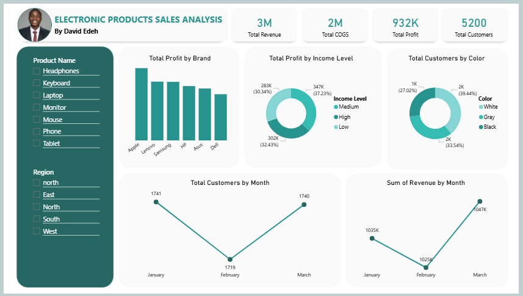

# Electronic Products Sales Analysis Dashboard

## Project Overview

This project is an interactive Power BI dashboard developed to analyze electronic product sales performance and generate actionable business insights. The dashboard focuses on profitability analysis, customer purchasing trends, revenue tracking, and product performance evaluation.

The project demonstrates business intelligence concepts including KPI reporting, dashboard design, trend analysis, and interactive data visualization using Microsoft Power BI.

---

## Business Problem

Businesses generate large volumes of sales data daily, but raw data alone does not provide meaningful insights for strategic decision-making.

This project was developed to answer important business questions such as:

- Which brands generate the highest profit?
- Which product colors are purchased most frequently?
- How does revenue trend across different months?
- Which months record the highest and lowest customer activity?
- How can sales performance be monitored effectively using interactive dashboards?

---

## Objectives

The objectives of this project were to:

- Analyze sales performance across electronic product brands
- Identify the most profitable brands
- Evaluate customer purchasing behavior by color preference
- Track monthly revenue trends
- Analyze monthly customer performance
- Build an interactive Power BI dashboard for business reporting

---

## Tools Used

- Microsoft Power BI
- Power Query
- DAX Measures
- Interactive Dashboard Design
- Data Visualization Techniques

---

## Dataset Description

The dataset contains electronic product sales records including:

- Product information
- Brand details
- Product colors
- Revenue
- Cost of Goods Sold (COGS)
- Profit metrics
- Customer data
- Regional information
- Monthly sales records

The Power BI model includes calculated measures and business metrics used for KPI reporting and trend analysis.

---

## Data Preparation Process

The following steps were performed during data preparation and modeling:

- Data cleaning and transformation
- Data type validation
- KPI metric generation
- Creation of calculated measures
- Dashboard modeling and visualization
- Interactive slicer configuration

---

## Analysis Performed

### 1. Brand by Profit Analysis
This analysis identified the most profitable electronic product brands based on total profit generated.

### 2. Customer Purchase Analysis by Color
This analysis evaluated customer purchasing patterns across different product colors to determine the most preferred colors.

### 3. Monthly Revenue Trend Analysis
This analysis tracked revenue performance across months to identify revenue growth and decline patterns.

### 4. Monthly Customer Trend Analysis
This analysis evaluated customer activity trends across months to identify high-performing and low-performing periods.

---

## Key Insights

- Apple generated the highest total profit among analyzed brands.
- White-colored products recorded the highest customer purchases.
- March recorded the highest monthly revenue.
- February showed the lowest customer activity among analyzed months.
- Revenue and customer trends showed noticeable month-to-month fluctuations.

---

## Dashboard Features

The dashboard includes:

### KPI Cards
- Total Revenue
- Total COGS
- Total Profit
- Total Customers

### Interactive Slicers
- Product Name Filter
- Region Filter

### Visualizations
- Brand Profit Analysis
- Customer Distribution by Color
- Monthly Revenue Trend
- Monthly Customer Trend
- Profit Analysis by Income Level

---

## Recommendations

Based on the analysis, the following recommendations were made:

- Increase focus on high-performing brands such as Apple.
- Prioritize inventory planning for highly preferred product colors.
- Investigate factors contributing to lower customer activity during February.
- Expand marketing strategies during high-performing periods to maximize revenue.
- Continuously monitor customer trends to improve sales forecasting and decision-making.

---

## Dashboard Preview



---

## Project Structure

```text
electronic-products-sales-analysis/
│
├── README.md
├── dataset/
└── visuals/
```

---

## Files Included

- Power BI project file (.pbix)
- Dashboard preview image
- Project documentation

---

## Skills Demonstrated

- Business Intelligence
- KPI Reporting
- Dashboard Design
- Interactive Data Visualization
- Trend Analysis
- Data Storytelling
- Analytical Thinking

---

## Author

David Edeh

<a href="https://github.com/DavidEdeh22"><kbd>Visit My GitHub Profile</kbd></a>
<a href="http://www.linkedin.com/in/david-edeh-84aa65232"><kbd>Visit My LinkedIn Profile</kbd></a>

---
